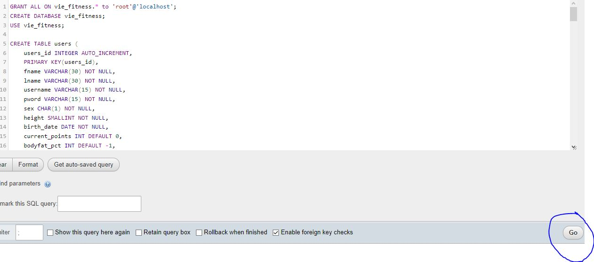
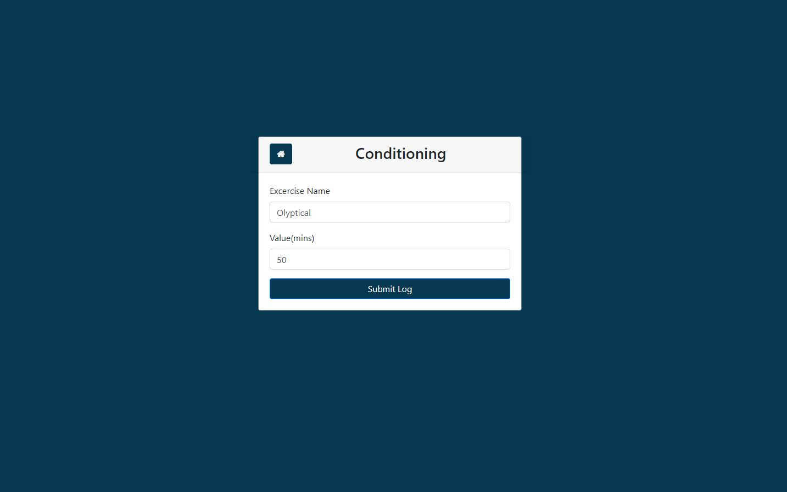
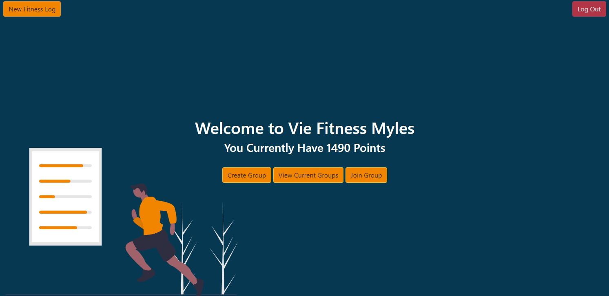
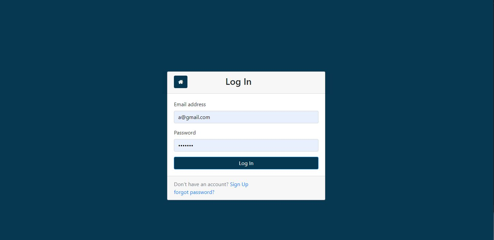
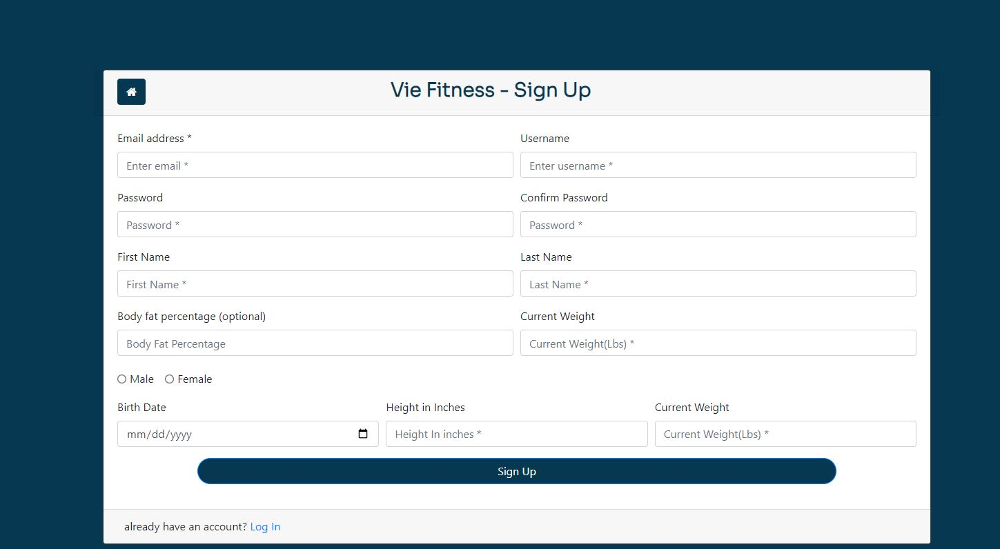

# Vie-Fitness-1.0

Project From Database Management Class

# To Run

- add repository to C:\xampp\htdocs
- start Apache and mySQL in XAMPP
- Copy and paste 'vie.sql' into phpmyadmin and press go
  
- To access go to localhost/Vie-Fitness-1.0/index.php

# ScreenShot

