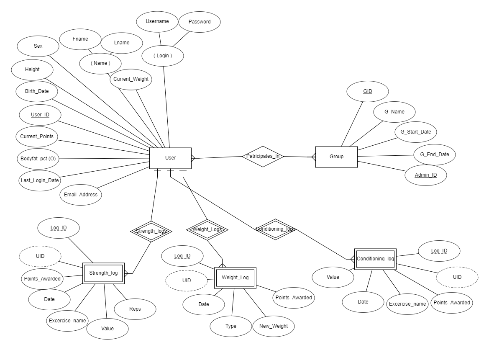
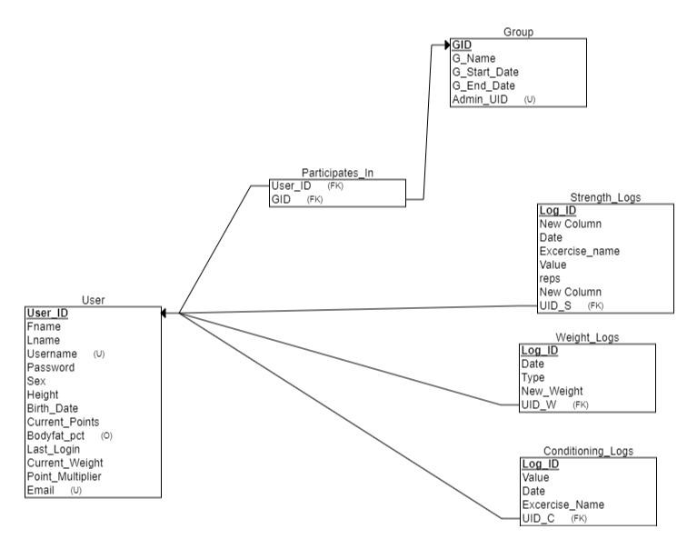

# Vie-Fitness-1.0

Project From My Database Management Systems Class

# Description

Vie Fitness is a web application and database that tracks users' progression towards personalized fitness goals. This web application allows users to compete with other users via groups that rank individuals based on a point system that takes into account individuals progress.

# Data

- Vie Fitness stores the following information about each user: name, User ID number, Username, password, phone number, birthdate, sex, current weight, current body fat percentage(optional), height, city, group(s) user participates in, current streak of days where user logged, current points.
- UserID number and Username have unique values for each user
- Each group is described by a group name, group ID number, group admin, number of group participants, group start date, group end date, users points earned
- Group ID number is a unique value for each group
- Weight log has a user, type (new weight, new body fat percentage), value, date, type of exercise, and points awarded.
- Strength log has User id, exercise name, exercise Id, description, reps, value, date, points awarded
- Conditioning log has User ID, exercise name, exercise Id, description, value, date, points awarded

# Database Schema

# To Run

- add repository to C:\xampp\htdocs
- start Apache and mySQL in XAMPP
- Copy and paste 'vie.sql' into phpmyadmin and press go
  
- To access go to localhost/Vie-Fitness-1.0/index.php

# ScreenShots

